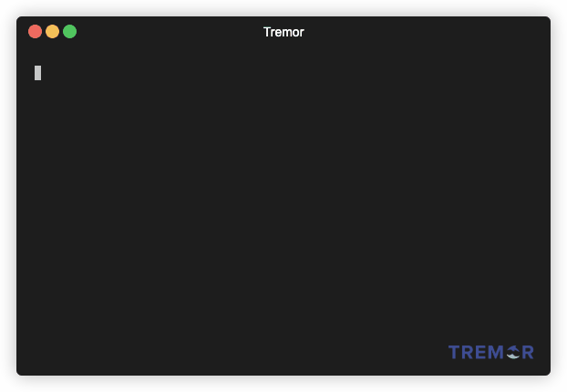
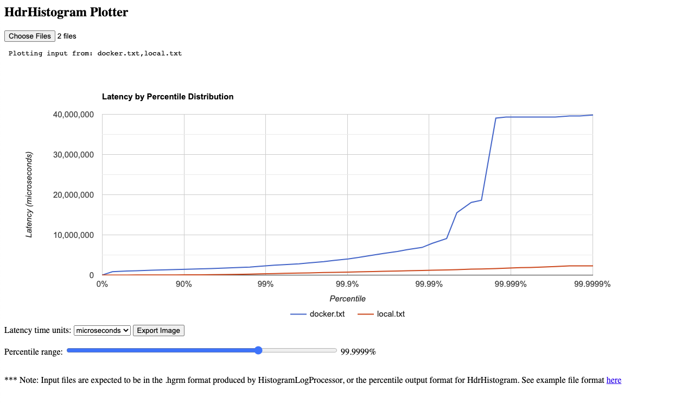

## Benchmarking
<!-- .slide: data-background="#FF7733" -->

Writing benchmarks with tremor

<div style='font-size: 20px'>
Warning: We do not recommend using docker based environment
for running benchmarks. In this tutorial we are simply exploring
the framework and how to write benchmarks.
</div>

>>>

### Create a container hierarchy for our suite

```shell
$ mkdir tests
$ mkdir tests/bench
$ echo '[ "bench", "docker" ]' > tests/bench/tags.json
$ echo '[ "all" ]' > tests/tags.json
cat <<DATA
{
    "kind": "Bench",
    "includes": "bench-*"
}
DATA > tests/bench/meta.json
```

<div style='font-size: 20px'>
We can create tags files in any directory called `tags.json` that
are a list of strings that we can use to include or exclude tests
from the test search path.  The `meta.json` file instructs tremor
that the directory structure is for a benchmark run.
</div>

---

#### Verify:  Container with no tests



```shell [1-2|3-4]
# Docker based invocation
$ trecker test bench /pwd/tests
# Local execution
$ tremor test bench tests
```

>>>

### Benchmark Anatomy

<div class='mermaid' class='slide'>
graph LR;
  Source[Blaster] -->|simulate| PE(Workload);
  PE --> |distribute| Sink(BlackHole);
</div>

|Element|Description|
|---|---|
|Blaster|A specialized source that injects events from an in memory cache into the pipeline under test|
|Workload|The tremor pipeline ( or pipelines ) under test|
|BlackHole|A specialized sink that captures events and records the processing time and throughput in a histogram|

<div style='font-size: 20px'>
The `blaster` and `blackhole` elements are designed to work together and should be used for benchmarking only.
Using these facilities in a production system may result in undefined behaviour.
</div>

---

### Inject via `blaster`

```yaml
onramp:
  - id: blaster
    type: blaster
    codec: string
    config:
      source: /pwd/tests/data/data.json.xz # newline delimited json
```

<div style='font-size: 20px'>
Blaster loads the event data archive into memory and continuously
replays the data generating a continuous stream of events
</div>

---

### Capture via `blackhole`

```yaml
offramp:
  - id: blackhole
    type: blackhole
    codec: string
    config:
      warmup_secs: 10 
      stop_after_secs: 100
      significant_figures: 2
```

<div style='font-size: 20px'>
BlackHole is the primary benchmark drive. We configure a warmup period to
allow the engine to acquiesce and attenuate to a stable streaming state.
We configure a test duration, after which the tremor runtime is stopped.
We configure histogram output to 2 significant digits of precision.
</div>

---

### Configure benchmark scenario

```yaml
binding:
  - id: bench
    links:
      "/onramp/blaster/{instance}/out": ["/pipeline/main/{instance}/in"]
      "/pipeline/main/{instance}/out": ["/offramp/blackhole/{instance}/in"]
```

<div style='font-size: 20px'>
We configure the benchmark as per the architecture diagram connecting the
data source ( blaster ) to the workload ( a trickle pipeline representing
the workload under test and we connect that pipeline to the blackhole.
</div>

---

### Provide the business logic

```trickle
# File: bench.trickle
# A simple passthrough streaming query or algorithm
select event from in into out;
```

---

### Configure the running instances

```yaml
mapping:
  /binding/bench/01:
    instance: "01"
```

<div style='font-size: 20px'>
We now have all the configuration needed to run the benchmark
</div>


>>>

### Benchmarking: Passthrough baseline

```shell
$ mkdir tests/bench/bench-baseline
```

<div style='font-size: 20px'>
Always define a passthrough baseline benchmark to establish the
overhead on our benchmark environment or lab equipment. Adding
logic, transformation or processing should deviate from our baseline
in predictable ways.
</div>

---

### Baseline Benchmark configuration

```yaml
# File: /pwd/tests/bench/bench-baseline/config.yaml
onramp:
  - id: blaster
    type: blaster
    codec: string
    config:
      source: /pwd/tests/data/data.json.xz
offramp:
  - id: blackhole
    type: blackhole
    codec: string
    config:
      warmup_secs: 10
      stop_after_secs: 100
      significant_figures: 2
binding:
  - id: bench
    links:
      "/onramp/blaster/{instance}/out": ["/pipeline/bench/{instance}/in"]
      "/pipeline/bench/{instance}/out": ["/offramp/blackhole/{instance}/in"]
mapping:
  /binding/bench/01:
    instance: "01"      
```

---

### Baseline Benchmark Dataset

```shell
$ cd tests/bench/bench-baseline
```

```
$ mkdir -p tests/data
$ echo '{"snot": "badger"}' >> tests/data/data.json
$ echo '{"snot": "badger"}' >> tests/data/data.json
$ echo '{"snot": "badger"}' >> tests/data/data.json
$ xz tests/data/data.json
```

<div style='font-size: 20px'>
Depending on your domain the content, format, size and structure
of the events are outside of the scope of this tutorial walkthrough.
When interacting with the core tremor team, we may request that you
run a standard tremor benchmark on your system so that we can compare
our numbers with your numbers if we're investigating optimizations or
regressions. Our mileage may vary here!
</div>

---

### Provide the business logic for our baseline benchmark

```trickle
# File: bench.trickle
# A simple passthrough streaming query or algorithm
select event from in into out;
```

---

### Run our baseline benchmark


```shell
trecker test bench /pwd/tests -i docker
```
<div style='font-size: 20px'>
Note that dockerized tests require setting a fully qualified
path to the data file so it won't run locally. We use a tag to
flag benchmarks as docker only. We can exclude docker for local
tests. Above we restrict test framework runs to benchmarks that
are tagged `docker`.
</div>

>>>

### Benchmarking: Passthrough baseline local

```shell
$ mkdir tests
$ mkdir tests/bench-local
$ echo '[ "bench", "local" ]' > tests/bench-local/tags.json
$ echo '[ "all" ]' > tests/tags.json
cat <<DATA
{
    "kind": "Bench",
    "includes": "bench-*"
}
DATA > tests/bench-local/meta.json
$ mkdir tests/bench-local/bench-baseline
```

<div style='font-size: 20px'>
Shortcut: Alternatively, copy the `bench` root and contents to `bench-local`
and tweak the tags and configuration by using this segment as a
reference.
</div>

---

### Baseline Benchmark local configuration

```yaml
# File: /pwd/tests/bench-local/bench-baseline/config.yaml
onramp:
  - id: blaster
    type: blaster
    codec: string
    config:
      source: tests/data/data.json.xz # changed to relative root
offramp:
  - id: blackhole
    type: blackhole
    codec: string
    config:
      warmup_secs: 10
      stop_after_secs: 100
      significant_figures: 2
binding:
  - id: bench
    links:
      "/onramp/blaster/{instance}/out": ["/pipeline/bench/{instance}/in"]
      "/pipeline/bench/{instance}/out": ["/offramp/blackhole/{instance}/in"]
mapping:
  /binding/bench/01:
    instance: "01"      
```

<div style='font-size: 20px'>
Different than docker case. See comment.
</div>

---

### Baseline Benchmark Dataset

```
$ mkdir -p tests/data
$ echo '{"snot": "badger"}' >> tests/data/data.json
$ echo '{"snot": "badger"}' >> tests/data/data.json
$ echo '{"snot": "badger"}' >> tests/data/data.json
$ xz tests/data/data.json
```

<div style='font-size: 20px'>
Same as docker case. Can be skipped.
</div>

---

### Provide the business logic for our baseline benchmark

```trickle
# File: bench.trickle
# A simple passthrough streaming query or algorithm
select event from in into out;
```

<div style='font-size: 20px'>
Same as docker case. Can be skipped.
</div>

---

### Run our local baseline benchmark


```shell
tremor test bench tests -i local
```

<div style='font-size: 20px'>
Note that this is not dockerized and as such is closer to a
benchmark run on a lab environment. If you are running this on
a development machine, ensure any non-essential UIs or processes
( such as docker desktop ) are shutdown before running and use
a release build of the tremor binary.
</div>

>>>

### Comparing benchmark histograms

Tremor uses high dynamic range histograms [HDR Histogram](http://hdrhistogram.org/) to
capture benchmark results.

```shell
$ cp tests/bench/bench-baseline/fg.out.log docker.txt
$ cp tests/bench-local/bench-baseline/fg.out.log local.txt
```

Load the test standard output into the HDR Histogram plotter to measure the
performance difference for a dockerized verses local test run.

[HDR Histogram Plotter](http://hdrhistogram.github.io/HdrHistogram/plotFiles.html)

<div style='font-size: 20px'>
Note that as we run each benchmark in different runs, we will need to copy these
output files individually after each run so we can compare them.
</div>

---

### Comparing Latency profiles



<div style='font-size: 20px'>
Typically a dockerized run will be a factor of 10x slower than a native run
when comparing benchmarks on the same machine. Try varying the data size, format,
logic or docker or local machine configuration to improve the results for each case!
</div>

>>>

### Tags

Use the `-i` and `-e` flags to `tremor test`

- Given: `-i foo bar`
 - Any `foo` or `bar` tagged tests

- Given: `-i foo bar -e baz bogo`
 - Any `foo` or `bar` tagged tests
 - Excluding `baz` and `bogo`

---

```shell [1-2|3-4|5-6|7-8]
# include `foo`, exclude `bar` bench tests
$ tremor test bench tests -i foo -e bar
# include `bar`, exclude `foo` bench tests
$ tremor test bench tests -i bar -e foo
# include `all` bench tests
$tremor test bench tests
# include `all` tests of all kinds
$ tremor test all tests
```

>>>

### Further reading

* [`tremor test ...`](https://docs.tremor.rs/operations/cli/#test)
* [Github - Tremor Benchmarks](https://github.com/tremor-rs/tremor-runtime/tree/main/tremor-cli/tests/bench)

>>>
### End of `benchmark` guide
<!-- .slide: data-background="#33FF77" -->

This is the end of the benchmark getting started guide

Note: This will only appear in speaker notes window
